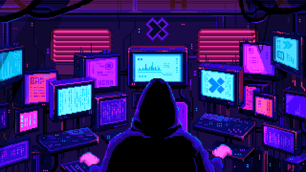
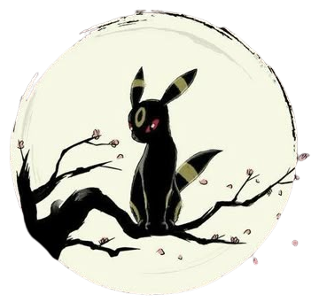

<!---->

  

<!--Night Owl image-->

  

<!--Header Name-->
#  About Me ! 
*Digital Craftsman ( Developer / Artist? )*
  

<!--Start Intro-->               

I’m Ethan a passionate Frontend Engineer, currently learn React and Nextjs 

- Web engineer born in the Department of Fine Arts 🎨
- Self taught web, dynamic and app developer 🖥️
- I believe in learning through practice 🌱
- Fun fact: Pokemon and illustrations 👾
 

##  </img> My Tech Stack 

### Front-End Development

 

### Technologies

 

### Design

 

  
<!--End Intro-->

<h2 align="center">
   Github Stats 
</h2>

    
    

 

<h2 align="center">
  
  Connect With Me
</h2>

 &nbsp;
 &nbsp;
 &nbsp;

<!--Footer--> 

  

